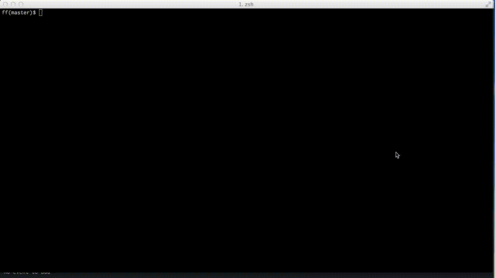

# ff

A fuzzy finder for the terminal.

## Demo

## Installation

    git clone https://github.com/Bogdanp/ff.git
    cd ff && cabal install
    echo "alias ff='ff +RTS -N && source ~/.ff.socket'" >> ~/.bashrc

## Usage

    ff
